---
## Front matter
title: "Лабораторная работа №5"
subtitle: "Дисциплина: Архитектура компьютера"
author: "Серебрякова Дарья Ильинична"

## Generic otions
lang: ru-RU
toc-title: "Содержание"

## Bibliography
bibliography: bib/cite.bib
csl: pandoc/csl/gost-r-7-0-5-2008-numeric.csl

## Pdf output format
toc: true # Table of contents
toc-depth: 2
lof: true # List of figures
lot: true # List of tables
fontsize: 12pt
linestretch: 1.5
papersize: a4
documentclass: scrreprt
## I18n polyglossia
polyglossia-lang:
  name: russian
  options:
	- spelling=modern
	- babelshorthands=true
polyglossia-otherlangs:
  name: english
## I18n babel
babel-lang: russian
babel-otherlangs: english
## Fonts
mainfont: IBM Plex Serif
romanfont: IBM Plex Serif
sansfont: IBM Plex Sans
monofont: IBM Plex Mono
mathfont: STIX Two Math
mainfontoptions: Ligatures=Common,Ligatures=TeX,Scale=0.94
romanfontoptions: Ligatures=Common,Ligatures=TeX,Scale=0.94
sansfontoptions: Ligatures=Common,Ligatures=TeX,Scale=MatchLowercase,Scale=0.94
monofontoptions: Scale=MatchLowercase,Scale=0.94,FakeStretch=0.9
mathfontoptions:
## Biblatex
biblatex: true
biblio-style: "gost-numeric"
biblatexoptions:
  - parentracker=true
  - backend=biber
  - hyperref=auto
  - language=auto
  - autolang=other*
  - citestyle=gost-numeric
## Pandoc-crossref LaTeX customization
figureTitle: "Рис."
tableTitle: "Таблица"
listingTitle: "Листинг"
lofTitle: "Список иллюстраций"
lotTitle: "Список таблиц"
lolTitle: "Листинги"
## Misc options
indent: true
header-includes:
  - \usepackage{indentfirst}
  - \usepackage{float} # keep figures where there are in the text
  - \floatplacement{figure}{H} # keep figures where there are in the text
---

# Цель работы

Целью данной лабораторной работы является приобретение практических навыков работы в Midnight Commander, освоение инструкций языка ассемблера mov и int.

# Задания

1. Основы работы с mc
2. Структура программы на языке ассемблера NASM
3. Подключение внешнего файла
4. Выполнение заданий для самостоятельной работы

# Теоретическое введение

Midnight Commander (или просто mc) — это программа, которая позволяет просматривать структуру каталогов и выполнять основные операции по управлению файловой системой, т.е. mc является файловым менеджером. Midnight Commander позволяет сделать работу с файлами более удобной и наглядной. Программа на языке ассемблера NASM, как правило, состоит из трёх секций: секция кода программы (SECTION .text), секция инициированных (известных во время компиляции) данных (SECTION .data) и секция неинициализированных данных (тех, под которые во время компиляции только отводится память, а значение присваивается в ходе выполнения программы) (SECTION .bss). Для объявления инициированных данных в секции .data используются директивы DB, DW, DD, DQ и DT, которые резервируют память и указывают, какие значения должны храниться в этой памяти:

DB (define byte) — определяет переменную размером в 1 байт;
DW (define word) — определяет переменную размеров в 2 байта (слово);
DD (define double word) — определяет переменную размером в 4 байта (двойное слово);
DQ (define quad word) — определяет переменную размером в 8 байт (учетве- рённое слово);
DT (define ten bytes) — определяет переменную размером в 10 байт. Директивы используются для объявления простых переменных и для объявления массивов. Для определения строк принято использовать директиву DB в связи с особенностями хранения данных в оперативной памяти. Инструкция языка ассемблера mov предназначена для дублирования данных источника в приёмнике.

mov dst,src

Здесь операнд dst — приёмник, а src — источник. В качестве операнда могут выступать регистры (register), ячейки памяти (memory) и непосредственные значения (const). Инструкция языка ассемблера intпредназначена для вызова прерывания с указанным номером.

int n

Здесь n — номер прерывания, принадлежащий диапазону 0–255. При программировании в Linux с использованием вызовов ядра sys_calls n=80h (принято задавать в шестнадцатеричной системе счисления).

# Выполнение лабораторной работы

## Основы работы с mc

Открываю Midnight Commander командой  mc (рис. [-@fig:001]).

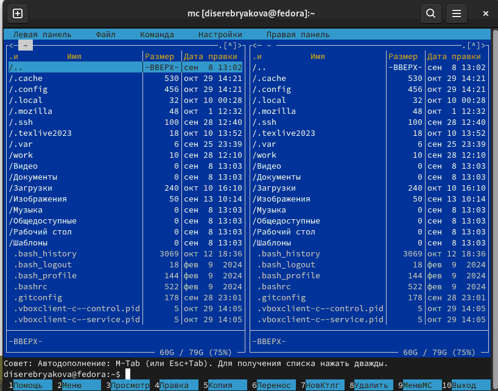{#fig:001 width=70%}

Перехожу в каталог ~/work/study/study_2024-2025_arch-pc, используя файловый менеджер mc и клавиши (рис. [-@fig:002]).

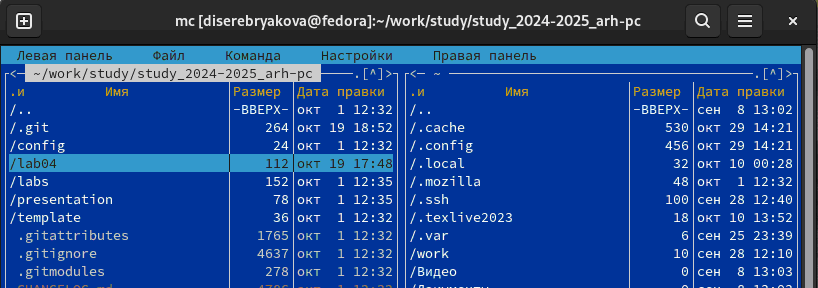{#fig:002 width=70%} 

С помощью функциональной клавиши F7 создаю папку lab05 и перехожу в созданный каталог (рис. [-@fig:003]).

{#fig:003 width=70%}

Пользуясь строкой ввода и командой touch создаю файл lab5-1.asm (рис. [-@fig:004]).

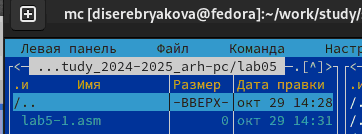{#fig:004 width=70%}

С помощью функциональной клавиши F4 открываю файл lab5-1.asm для редактирования во встроенном редакторе mcedit (рис. [-@fig:005]).

{#fig:005 width=70%}

Ввожу текст программы из предложенного листинга 5.1, сохраняю изменения и закрываю файл (рис. [-@fig:006]).

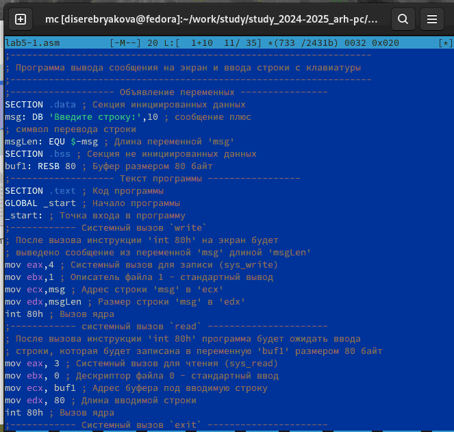{#fig:006 width=70%}

С помощью функциональной клавиши F3 открываю файл lab5-1.asm для просмотра. Убеждаюсь, что файл содержит текст программы (рис. [-@fig:007]).

{#fig:007 width=70%}

Транслирую текст программы файла в объектный файл командой nasm -f elf lab5-1.asm. Создался объектный файл lab5-1.o. (рис. [-@fig:008]).

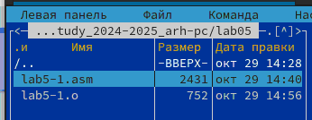{#fig:008 width=70%}

Выполняю компоновку объектного файла с помощью команды ld -m elf_i386 -o lab5-1 lab5-1.o. Создался исполняемый файл lab5-1.(рис. [-@fig:009]).

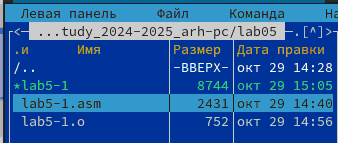{#fig:009 width=70%}

Запускаю исполняемый файл командой ./lab5-1. Программа выводит строку "Введите строку: " и ждет ввода с клавиатуры, я ввожу свои ФИО, на этом программа заканчивает свою работу (рис. [-@fig:010]).

{#fig:010 width=70%}

Введенные выше команды (рис. [-@fig:011]).

{#fig:011 width=70%}

## Подключение внешнего файла in_out.asm

Скачиваю файл in_out.asm со страницы курса в ТУИС. Он сохранился в каталог "Загрузки" (рис. [-@fig:012]).

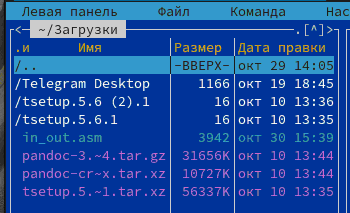{#fig:012 width=70%}

В одной из панелей mc открываю каталог с файлом lab5-1.asm. В другой панели каталог со скаченным файлом in_out.asm. Копирую файл in_out.asm в каталог с файлом lab5-1.asm с помощью функциональной клавиши F5 (рис. [-@fig:013]).

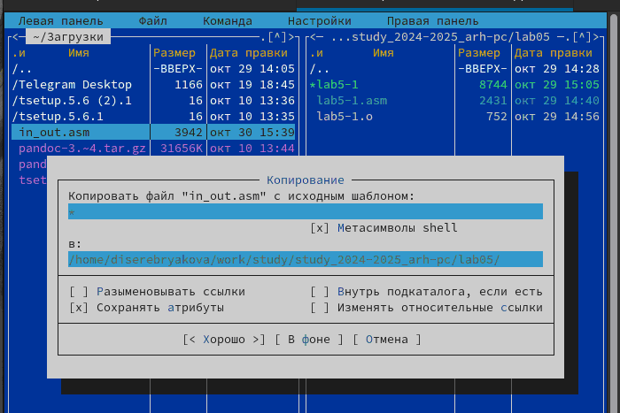{#fig:013 width=70%}

С помощью функциональной клавиши F5 создаю копию файла lab5-1.asm с именем lab5-2.asm (рис. [-@fig:014]).

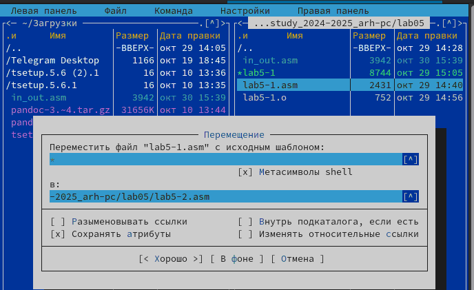{#fig:014 width=70%}

Исправляю текст программы в файле lab5-2.asm с использование подпрограмм из внешнего файла in_out.asm (использую подпрограммы sprintLF, sread и quit) (рис. [-@fig:015]).

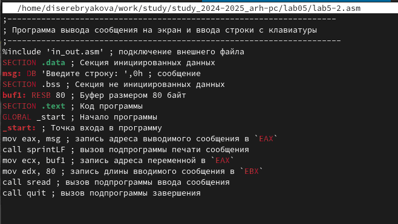{#fig:015 width=70%}

Создаю объектный файл lab5-2.o, отдаю его на обработку компоновщику, получаю исполняемый файл lab5-2, запускаю полученный исполняемый файл. Программа запрашивает ввод, ввожу свои ФИО, далее программа выводит введенные мною данные (image/рис. [-@fig:016]).

{#fig:016 width=70%}

В файле lab5-2.asm заменила подпрограмму sprintLF на sprint. Создала исполняемый файл и запустила его (рис. [-@fig:017]).

{#fig:017 width=70%}

Разница между исполняемым файлом lab5-2 и только что измененным этим файлом в том, что запуск первого запрашивает ввод с новой строки, а программа, которая исполняется при запуске второго, запрашивает ввод без переноса на новую строку, потому что в этом заключается различие между подпрограммами sprintLF и sprint

# Выполнение заданий для самостоятельной работы

Создаю копию файла lab5-1.asm с именем lab5-1-1.asm с помощью функциональной клавиши F5 (рис. [-@fig:018]).

{#fig:018 width=70%}

С помощью функциональной клавиши F4 открываю созданный файл для редактирования. Изменяю программу так, чтобы кроме вывода приглашения и запроса ввода, она выводила вводимую пользователем строку  (рис. [-@fig:019]).

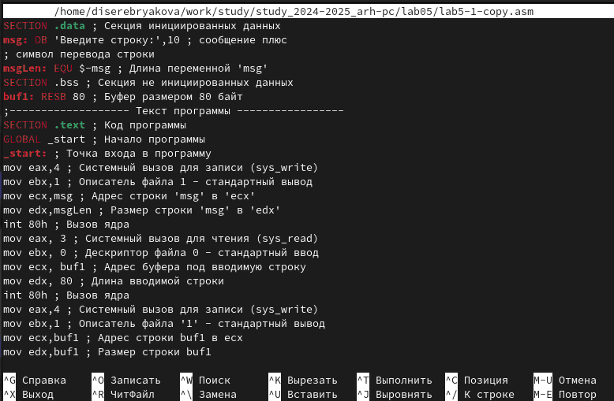{#fig:019 width=70%}

Теперь проверю правильность работы отредактированного файла. Создаю объектный файл lab5-1-copy.o, отдаю его на обработку компоновщику, получаю исполняемый файл lab5-1-copy, запускаю полученный исполняемый файл. Программа запрашивает ввод, ввожу свою фамилию, далее программа выводит введенные мною данные   (рис. [-@fig:020]).

{#fig:020 width=70%}

Создаю копию файла lab5-2.asm с именем lab5-2-copy.asm с помощью функциональной клавиши F5 (рис. [-@fig:021]).

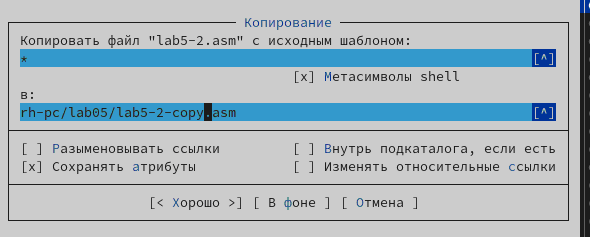{#fig:021 width=70%}

Исправляю текст программы с использование подпрограмм из внешнего файла in_out.asm, так чтобы она работала по следующему алгоритму: 
• вывести приглашение типа “Введите строку:” 
• ввести строку с клавиатуры
• вывести введённую строку на экран
 (рис. [-@fig:022]).

{#fig:022 width=70%}

Создаю объектный файл lab5-2-copy.o, отдаю его на обработку компоновщику, получаю исполняемый файл lab5-2-copy, запускаю полученный исполняемый файл. Программа запрашивает ввод без переноса на новую строку, ввожу свою Фамилию, далее программа выводит введенные мною данные (рис. [-@fig:023]).

{#fig:023 width=70%}

# Выводы

При выполнении данной лабораторной работы я приобрела практические навыки работы в Midnight Commander, а также освоила инструкции языка ассемблера mov и int.

# Список литературы{.unnumbered}

Лабораторная работа №5 
