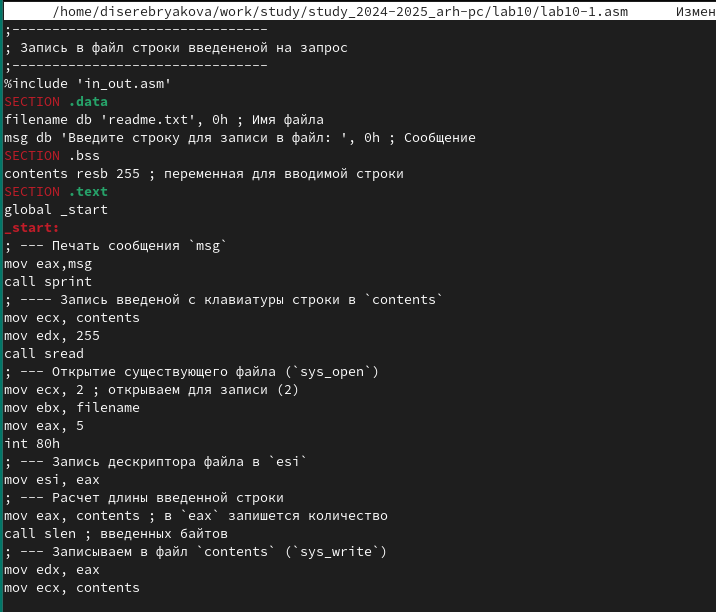
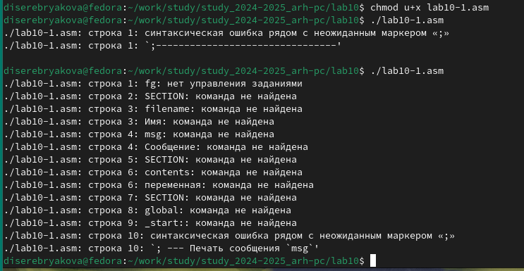
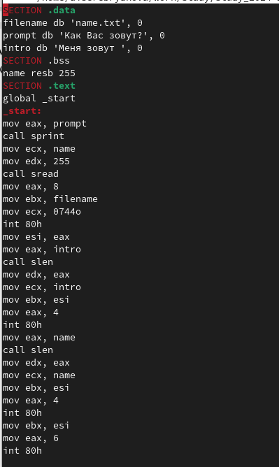

---
## Front matter
title: "Лабораторная работа №10"
subtitle: "Дисциплина: Архитектура компьютера"
author: "Серебрякова Дарья Ильинична"

## Generic otions
lang: ru-RU
toc-title: "Содержание"

## Bibliography
bibliography: bib/cite.bib
csl: pandoc/csl/gost-r-7-0-5-2008-numeric.csl

## Pdf output format
toc: true # Table of contents
toc-depth: 2
lof: true # List of figures
lot: true # List of tables
fontsize: 12pt
linestretch: 1.5
papersize: a4
documentclass: scrreprt
## I18n polyglossia
polyglossia-lang:
  name: russian
  options:
	- spelling=modern
	- babelshorthands=true
polyglossia-otherlangs:
  name: english
## I18n babel
babel-lang: russian
babel-otherlangs: english
## Fonts
mainfont: IBM Plex Serif
romanfont: IBM Plex Serif
sansfont: IBM Plex Sans
monofont: IBM Plex Mono
mathfont: STIX Two Math
mainfontoptions: Ligatures=Common,Ligatures=TeX,Scale=0.94
romanfontoptions: Ligatures=Common,Ligatures=TeX,Scale=0.94
sansfontoptions: Ligatures=Common,Ligatures=TeX,Scale=MatchLowercase,Scale=0.94
monofontoptions: Scale=MatchLowercase,Scale=0.94,FakeStretch=0.9
mathfontoptions:
## Biblatex
biblatex: true
biblio-style: "gost-numeric"
biblatexoptions:
  - parentracker=true
  - backend=biber
  - hyperref=auto
  - language=auto
  - autolang=other*
  - citestyle=gost-numeric
## Pandoc-crossref LaTeX customization
figureTitle: "Рис."
tableTitle: "Таблица"
listingTitle: "Листинг"
lofTitle: "Список иллюстраций"
lotTitle: "Список таблиц"
lolTitle: "Листинги"
## Misc options
indent: true
header-includes:
  - \usepackage{indentfirst}
  - \usepackage{float} # keep figures where there are in the text
  - \floatplacement{figure}{H} # keep figures where there are in the text
---

# Цель работы

Приобретение навыков написания программ для работы с файлами.

# Задание

1. Создание файлов в программах
2. Изменение прав на файлы для разных групп пользователей
3. Выполнение самостоятельных заданий по материалам лабораторной работы

# Теоретическое введение

ОС GNU/Linux является многопользовательской операционной системой. И
для обеспече- ния защиты данных одного пользователя от действий других
пользователей существуют специальные механизмы разграничения доступа к
файлам. Кроме ограничения доступа, дан- ный механизм позволяет разрешить
другим пользователям доступ данным для совместной работы.

# Выполнение лабораторной работы

Создаю каталог для программам лабораторной работы № 10, перехожу в него и моздаю файлы lab10-1.asm, readme-1.txt и readme-2.txt (рис. [-@fig:001]).

{#fig:001 width=70%}

Ввожу в файл lab10-1.asm текст программы из листинга 10.1 (рис. [-@fig:002]).

{#fig:002 width=70%}

Создаю исполняемый файл и запускаю его. Программа просит на ввод строку, после чего создает текстовый файл с введенной пользователем строкой (рис. [-@fig:003]).

{#fig:003 width=70%}

Меняю права владельца, запретив исполнять файл, после чего система отказывает в исполнении файла, т.к. я - владелец - запретила сама себе же исполнять программу (рис. [-@fig:004]).

{#fig:004 width=70%}

Добавляю к исходному файлу программы права владельцу на исполнение, исполняемый текстовый файл интерпретирует каждую строку как команду, так как ни одна из строк не является командой bash, программа абсолютно ничего не делает (рис. [-@fig:005]).

{#fig:005 width=70%}

Согласно своему варианту, мне нужно установить соответсвующие ему права на текстовые файлы, созданные в начале лабораторной работы: 1. В символьном виде для 1-го readme файла –x -w- -w2. В двоичной системе для 2-го readme файла 001 011 101 Перевожу группу битов в восьмеричную систему, символьную запись подгоняю под синтаксис и получаю нужные аргументы для chmod (рис. [-@fig:006]).

{#fig:006 width=70%}

## Задание для самостоятельной работы

Пишу программу, транслирую и компилирую. Программа должна выводить приглашение, просить ввод с клавиатуры и создавать текстовый файл с указанной в программе строкой и вводом пользователя (рис. [-@fig:007]).

{#fig:007 width=70%}

Запускаю программу, проверяю наличие и содержание созданного текстового файла, программа работает корректно (рис. [-@fig:008]).

{#fig:008 width=70%}

# Выводы

В ходе выполнения работы приобретены навыки написания программ для работы с файлами

# Список литературы{.unnumbered}

1. Лабораторная работа 10
